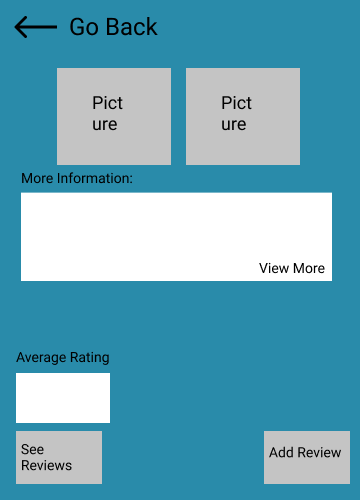

## System Definition (MS0)
Revind is an app where people from all corners of the world can leave their opinions and ideas on all sorts of things.A restaurant they liked, a product that changed their life or an experience they would never like to relive.Here people can get a feel and understanding for items they wish to buy, places they want visit and so on. Revind will give people a sense of confidence in what to expect and all the different types of experiences to look forward to.

### Home Page sketch

Home Page
This will be our welcome page where we invite our user to join the app or sign in using their existing username and password.
### Search Page sketch

Search Page
Here users can search for a specific place in mind they wish to find reviews on.

Account Page
Here a user can see their own profile, their own reviews, /*and change their usernames*/.

Toplist Page
On this page, a user is able to see the items with the highest ratings, and can get an overall feel of the most customer valued items.

### Item Page sketch

Places/items Page
On this page, a user is able to see information about the item, and is able to leave reviews on their experience with the item/at the place.

### App Suggestion Page sketch

App Suggestion Page:
On this page, a user is able to leave a suggestion for the development team by filling out a title, and a description, that they wish to have added/changed to the application/platform.

Rough sketches can be found at ./images/sketches

### Entity-Relationship (ER) Diagram

